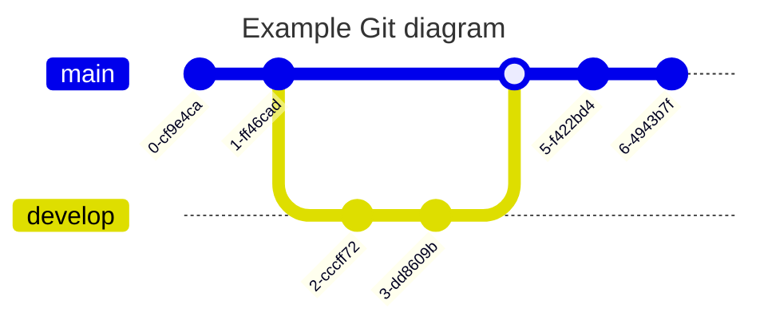

[toc]

`mermaid` 支持流程图、甘特图和时序图，但是经过这次尝试，结论就是画图的话还是使用专业的画图工具，这个只能作为一种简单选项用在简单场景下。所以这里就只总结一下流程图的使用，其它两种就没必要了，不是怎么好用。

[mermaid官网](https://mermaid.js.org/intro/)

# 流程图方向

流程图总体分为横向和纵向两种。总共四个方向：T-上，B\D-下；L-左，R-右。使用方式就是横向的两两结合，纵向的两两结合。比如从左到右为LR，从上到下为TB或者TD。

从上到下演示：


从左到右演示：


# 流程图节点

下面展示的流程图节点有矩形 `'[]'`，圆角矩形 `'()'`，不对称矩形 `'>]'`，菱形 `'{}'`，圆形 `'(())'`。在每个节点前面需要唯一标识该节点ID。如下示例：


# 节点间的连接关系

- 节点之间的连接线分为：实线 '---'、加粗实线 '==='、虚线 '-.-'。
- 带箭头的连接线分为：带箭头实线 '-->'、带箭头加粗实线 '==>'，带箭头虚线 '-.->'。
- 如果要在连接线上加上备注，则上面两类加备注的方式如下：
  - 实线备注 '--yes---'，加粗实线备注 'yes='，虚线备注 '-.yes.-'。
  - 带箭头实线备注 '--yes-->'，带箭头加粗实线备注 'yes>'，带箭头虚线备注 '-.yes.->'

其中，每种连接符号的左边是开始节点，右边是结束节点，可以由同一个节点指向不同节点，也可以由不同节点指向同一个节点，实现各种指向方式都是通过节点ID标注。

示例如下：


由同一个节点开始，使用方式如下，对于后面如果使用同一个节点，只用指明ID即可。


# 冒泡排序流程图

在这里用一个冒泡排序来简单的练习一下上面的几个点，首先将冒泡排序的伪码粘贴上来：

```
BUBBLESORT(A)
	for i = 1 to A.length-1
		for j = A.length downto i + 1
			if A[j] < A[j - 1]
				exchange A[j] with A[j - 1]
```

演示代码如下：


# 类图

## 类关系


## 类成员


# 时间线


# XY 图表


# 时序图

## 普通时序图


## 带循环、条件的时序图


## 带自循环时序图


# 脑图

## 简单实例


# Git提交历史



## 给提交自定义ID


## 一个比较复杂的提价历史图


# 甘特图

